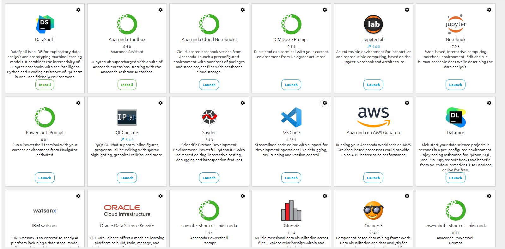

# Agarpyo

Agarpyo est un jeu local dans lequel le joueur contrôle une cellule dans un espace bidimensionnel. Le but est de devenir la plus grosse cellule en absorbant des cellules plus petites tout en évitant d'être touché par des cellules piègeuses. Le jeu est caractérisé par sa simplicité et son addictivité, avec des mécanismes de jeu simples mais stratégiques.

## Prérequis

Assurez-vous d'avoir les versions spécifiées des packages suivants installées sur votre système, ainsi que Python.

- Installer Anaconda (https://www.anaconda.com/download)
- Python (version utilisée pour le développement : 3.10.13)

## Installation

Clonez le dépôt sur votre machine locale.

```bash
git clone https://github.com/B2-Info-23-24/agarpyo-b2-b-alvine17.git
```

Accédez au répertoire du projet.

```bash
cd ../agarpyo-b2-b-alvine17
```

Créez un environnement virtuel 


## Utilisation

Choisissez votre IDE pour pouvoir experimenter le jeu.


Vous vous trouverez face à un menu une fois l'application lancé. 


Sélectionnez votre niveau, puis comment voulez vous jouer au jeu 


Puis savourez le jeu comme il se doit 


- Vous etes le point jaune et votre objectif est de manger un maximum de points verts possible pendant 1 minutes, le tout en évitant les points rouges sur la map.
- Les touches du claviers sont W pour monter, S pour descendre, A pour aller à gauche et D pour aller à droite.
- Vous pourrez quitté l'application en appuyant sur "q"
- Vous pourrez retourner au menu des niveaux via le menu de fin ou en appuyant sur "echap"
## Contribution

Si vous souhaitez contribuer à ce projet, veuillez suivre les étapes suivantes :

1. Forkez le projet.
2. Créez une branche pour votre fonctionnalité (**git checkout -b fonctionnalite/ma-fonctionnalite**).
3. Committez vos changements (**git commit -m 'Ajouter une nouvelle fonctionnalité'**).
4. Poussez la branche sur votre fork (**git push origin fonctionnalite/ma-fonctionnalite**).
5. Ouvrez une pull request.

## Licence
Windows.
## Contact

MPANZU Alvine.


